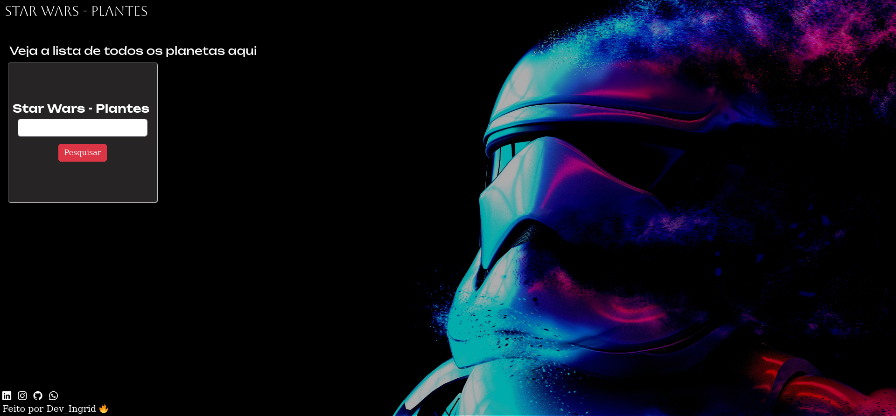

# Star Wars Planets
 Consumindo API do Star Wars, SWAPI, e capturando as informações sobre planetas que existem no universo de Star Wars.

Site da API: <a href="https://swapi.dev">SWAPI</a>
 <ul>
    <li>Nome dos planetas</li>
    <li>Clima</li>
    <li>Terreno</li>
    <li>População</li>
 </ul>

## Table of contents

- [Planetas](#planetas)
- [Screenshot](#screenshot)
- [Links](#links)
- [Author](#author)

## Planetas

    "Tatooine", "Alderaan", "Yavin IV", "Hoth", "Dagobah", "Bespin", "Endor", "Naboo", "Coruscant", "Kamino"

## Screenshot

## Links

- Solution URL: [Solution here](https://ingridssilveira.github.io/starWars-Planets/)

## Linguagem

<strong>Desenvolvido com:</strong>

<ul>
        <li>HTML;</li>
        <li>Bootstrap;</li>
        <li>SCSS(SASS): 
            <ul>
                <li>Variáveis e Mixins;</li>
            </ul>
        <li>Javascript: </li>
            <ul>
                <li>Async/Await;</li>
                <li>Fetch;</li>
                <li>Map;</li>
                <li>Filter;</li>
                <li>Manipulação de DOM.</li>
            </ul>
</ul>

## Author

- Website - [Ingrid Souza](https://ingridssilveira.github.io/IngridSouza)
- GitHub - [@IngridsSilveira](https://github.com/IngridsSilveira)
